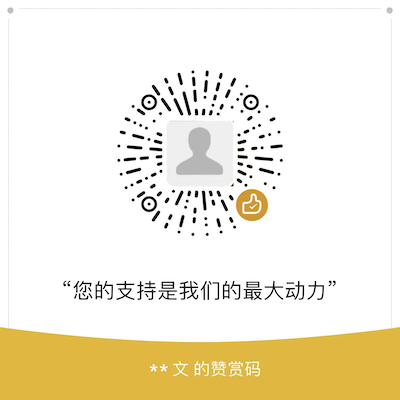

# developer-navigation
记录开发者常用工具信息，包含不限于技术及生活

# AI相关
1. **最懂程序员的新一代AI搜索引擎** <https://devv.ai/>
2. **按需生成演示文稿**，[https://www.decktopus.com/](https://www.decktopus.com/)
3. **OpenAl：GPT最佳实践(大白话编译解读版)**，强烈建议大家通读和收藏这份GPT官方教程解读文档：《OpenAl：GPT最佳实践(大白话编译解读版)》可以说是网络中最好的中文解读版本，语言风格直白且补充了各种实用案例。总结就是：排版精美、通俗易懂、教程全面、示例丰富、看了就会！<https://futureforce.feishu.cn/file/CMpdbLxAhon5K5x5C1OcciYwnOf>

# 史上最牛开源项目
1. **抠图工具**,基于Webgpu技术和wasm技术的免费开源inpainting工具, 纯浏览器端实现，<https://github.com/lxfater/inpaint-web/tree/main>
2. 开源GPTs导航项目**gpts-works**，这份代码不是静态导航页面，而是动态的，直接从数据库获取数据的，也就是说其实你不仅仅可以用于做 GPTs 导航，你可以用来做通用导航站<https://github.com/all-in-aigc/gpts-works>
3. **Public APIs**,搜集了软件行业各种各样免费公开的 API，各种类型分类，特别多特别全，感觉有好几百，非常值得收藏，Stars 是惊人的 262K！非常多小众的 API 都让我看呆了，比如说动物图片 API…，<https://github.com/public-apis/public-apis>
4. **talk**，开源的基于WebRTC的点对点的群组视频通话应用，这是一款免费开源的p2p群组视频通话应用，不需要注册，也没有下载。适用于所有主流浏览器。 Talk是使用WebRTC构建的，因此所有的视频，音频和文字聊天都是点对点的。采用WebRTC网格实现群组视频通话。所以通话质量与通话人数在平均高速连接中大约是6到8人。<https://github.com/vasanthv/talk>

# GPTs大全
超全的 GPTs 资源大全，10,000 多个GPTs全介绍，专门用来找寻各种 GPTs
1. gptshunter，网址：[https://gptshunter.com](https://gptshunter.com)  特点：收录多，目前收录了9900+ GPTs
2. gptstoday，网址：[https://gptstoday.com](https://gptstoday.com)  特点：可以搜索，可以自己提交，目前收录了9100+GPTs
3. gptlet，网址：[https://gptlet.app](https://gptlet.app)  特点：有分类。目前收录了约 570 个
4. aiweaver，网址：[https://aiweaver.feishu.cn/wiki/Nr20wfev0iH9oWkhxkVcFhQsn7g](https://aiweaver.feishu.cn/wiki/Nr20wfev0iH9oWkhxkVcFhQsn7g)  特点：分类比较好，还有其它的AI资源。 收录大概155个GPTs
5. allgpts，网址：[https://allgpts.co](https://allgpts.co)  特点：有分类，可搜索。 目前收录了82个GPTs

# 编码人生
1. **免费学习编程网站** Since 2014, more than 40,000 freeCodeCamp.org graduates have gotten jobs at tech companies including: Apple, Google, Microsoft, Spotify, amazon.com  <https://www.freecodecamp.org/>

# 在线开源书籍
1. **李笑来作品集** <https://lixiaolai.com/#/>
2. **Hello算法** <https://www.hello-algo.com/>

# 最全书籍下载资源
1. **安娜的档案** <https://zh.annas-archive.org/>，人类历史上最大的完全开放的图书馆。 ⭐️ 不仅是 Sci-Hub, LibGen, Z-Lib 的镜像。📈 25,077,770 本图书、99,425,873 篇论文——永久保存。
2. **无名图书** <https://www.book123.info/>, 带分类浏览，完全免费下载，可以按书名、作者、ISBN搜索，完全无套路。

# 生活学习
1. **默沙东诊疗手册**，没事少百度，这么说吧凡是网络那些问诊我直接贴手册里的方案应该可以超过一半的医师，很贴心还分个人版、医师版，不像你们互联网为了收钱，人家细分是为了让你看懂，全免费的，别多说，你先收藏，多看看这样跟医师沟通也效率更高些，<https://www.msdmanuals.cn/home>
2. **医学微视**, 医学微视是一个以视频的方式分享各种医学知识的良心网站，它上面的视频全部支持免费观看，是一个非常实用的免费医学教育网站。它是中国医学科学院健康科普研究中心监制的一个网站，并且不提供销售任何产品，它以短视频的形式帮助你了解各种疾病，通俗易懂，让你轻松了解各种医学知识；当我们遇到不懂的医学知识或者健康问题，直接利用这个网站，找到对应的疾病，就可以轻松找到对应的视频。<https://www.mvyxws.com/>
3. **国图公开课**，国图公开课是中国国家图书馆推出的一个高质量免费在线学习网站，它以传承和弘扬先进文化与中华优秀传统文化为核心，并且提供多种形态的学习资源。它免费提供了丰富并且免费的视频课程，你可以选择最新课程，也可以选择授课教师参与学习；当然你也可以利用网站强大的搜索功能搜索你需要学习的视频课程。它对视频课程进行了详细的分类，包括：百部经典、专题课程、读书推荐、馆员课程、典籍鉴赏、名著品读、非遗漫谈、走进名城、养生智慧、父母课程、名人故事、抗战风云、音乐之声、阅读之旅。其中百部经典包括了：管子、论语、孙子兵法、孟子；专题课程包括了：昆曲、诗经二十讲、汉字与中华文化、丝绸之路与丝路之绸、中国大发明、中国古代建筑文化与艺术、世界古代史。每个视频都提供了很多讲视频，并且支持超清播放，支持添加学习笔记，支持字幕功能，支持知识卡片，支持关联课程和拓展学习功能 <http://open.nlc.cn/onlineedu/client/index.htm>
4. **科普中国**, 科普中国是中国科协主办的权威科普网站，它提供了丰富并且权威的科普内容，帮助你增长见识，学习各种知识，是一个内容全面并且功能丰富的教育资源网站。它提供的科普内容形式包括：文字、图片、长图、漫画、视频、图文等。它首页提供的内容版块包括：前沿、健康、百科、科幻、安全、人物、辟谣、智农；其中智农版块提供了丰富的农业科普知识和视频课程。<https://www.kepuchina.cn/>
5. **大学资源网**，大学资源网是一个完全免费并且功能非常强大的学习网站，它免费提供了丰富并且全面的学习视频教程，并且视频课程一直在更新，非常良心。它提供了丰富的大学课程，包括：经济管理、医学课程、市场营销、机械电子、大学理工、公开课程、名校公开课、建筑工程、环境地理、社会科学、创新技术、电子通讯、哲学课程、自然科学、人力资源、石油化工。<https://www.dxzy163.com/>
6. **国家教育资源公共服务平台**，国家教育资源公共服务平台是一个完全免费的高质量精品学习网站。它提供的学习课程包括：小学课程、初中课程、高中课程；它的课程数量非常丰富，目前提供了多达 2000 多万个高质量课程，并且包括全国范围内的小学、初中、高中课程，每个课程的质量都是非常高。它的界面简洁干净，整体布局清晰明了，让你拥有出色的视觉体验。<https://1s1k.eduyun.cn/portal/html/1s1k/course/1.html>
7. **中国数字科技馆**，中国数字科技馆是中国科协、教育部、中国科学院共同建设的一个国家级公益性科普服务平台，它面向全体公众开放，你可以在这个平台上了解科学动态，体验科学过程、增长科学知识和科普知识。它以多种方式提供科学和科普内容，包括：文字、图片、音频、视频、游戏、直播、虚拟现实、线上和线下活动。<https://www.cdstm.cn/>
8. **优优教程网**，优优教程网是一个功能强大，内容全面的设计软件学习网站，它不仅提供了丰富的视频教程，还提供了丰富的文字教程。它还提供了各种设计软件，设计网站，设计资源。它提供的视频和文字教程包括：PS 教程、AI 教程、AE 教程、C4D 教程、手绘教程、摄影后期教程、视频剪辑教程、其它教程。它的知识树版块提供了各种零基础入门视频教程，并且这些零基础入门视频教程全部是可以直接免费观看的。如果你是完全零基础，这个版块的免费学习视频教程你不能错过。<https://uiiiuiii.com/>
9. **壹课堂**，壹课堂是一个功能非常强大的在线视频教程网站，它上面的所有视频课程支持直接免费观看。它支持的视频课程种类非常丰富，包括：历史，文学，哲学，医学，农学，艺术，基础学科，工程技术，法律学，数学，中国哲学，美术学，影视学。例如：高等数学，大学物理，生理学，大学英语，概率论与数理统计，线性代数，临床药理学，微生物学，动力气象学，唐宋诗词鉴赏，影视剧作，自动控制原理，社会心理学等等具体专业视频课程都可以在这个网站直接观看学习。它还支持通过具体高校来搜索课程，你可以直接找到你想看的高校，然后就可以观看学习这个大学的所有视频课程。最后网站上面的视频不仅支持直接观看，它的下载专区还提供视频教程下载功能。<http://www.1ketang.com/>
10. **中国高校外语慕课平台**，中国高校外语慕课平台是北京外国语大学中国高校外语慕课联盟的课程平台，是一个以外语特色为主的慕课平台，汇聚了国内外各大高校的优质外语课程。它提供了免费并且丰富的的外语课程，你可以直接搜索你想学习的外语课程，也可以利用网站的课程分类功能找到需要学习的外语课程。它的视频课程涵盖的语种包括：英语、日语、韩语、俄语、法语、德语、西班牙语、阿拉伯语、意大利语、泰语。<https://moocs.unipus.cn/>
11. **语文迷**，语文迷是一个功能非常强大并且完全免费的语文知识综合学习网站，它提供了丰富并且免费的语文学习素材和学习工具，不仅适用于学生，也适用于老师。它提供了丰富的语文学习素材，包括：语文基础知识、诗词学习、故事大全、国学经典。其中故事大全包括：寓言故事、睡前故事、成语故事、四大名著、一千零一夜、安徒生童话；国学经典包括：经部、史部、子部、集部、蒙学、世情小说、历史演义、历史小说、志怪小说。<https://www.yuwenmi.com/>
12. **大学自学网**，大学自学网是一个完全免费的大学生自学网站，它不仅支持免费在线观看所有学习视频，还支持免费下载所有学习视频，是一个可以满足很多人自学需求的良心网站。它的学习视频非常丰富全面，并且进行了精心的分类，包括：英语四六级、经管政法、电气电子、计算机、机械土建、医药健康、数理化生、农林地理、人文哲史、歌舞艺术、国际公开课、软件自学网。它的专题学习视频版块包括：App 开发、网站制作、计算机二级、计算机三级、注册会计师/ CPA 、会计从业资格考试、证券从业资格考试、一级建造师、考研、看电影学外语。它的学习视频全面并且丰富，并且视频一直在更新，你可以在网站的最近更新版块看到最新更新的学习视频。<http://v.dxsbb.com/>
13. **华文慕课**，华文慕课是北京大学联合阿里巴巴推出的一个以中文为主的慕课服务平台，为用户提供来自北大等知名高校的免费课程。它对所有课程进行了详细的分类，包括：计算机、理学、工程、法与社会、文学、历史、哲学、经济管理、教育、艺术、医学、就业创业等。它提供了丰富的特色课程，并且对所有课程按照最新排序和热度排序。你可以通过网站强大的课程分类功能找到需要学习的课程，也可以利用网站的搜索功能搜索需要学习的课程。它的搜索功能支持按照课程名称、老师姓名等关键词进行搜索。你可以利用这个网站学习的内容包括：微积分、离散数学、地理学、热学、有机化学、电磁学、大学化学、生物学。你还可以学习心理学、营养学、电子商务、算法、大数据、数据结构、计算机组成、Java 、人工智能、操作系统、计算机基础、计算机网络、设计模式。你还可以学习跆拳道、健身、射箭、乒乓球等。<http://www.chinesemooc.org/>

# 支持
感谢您的慷慨捐赠，您的支持对我们来说意义重大，这会是我们持续输出优质内容的最强动力。

